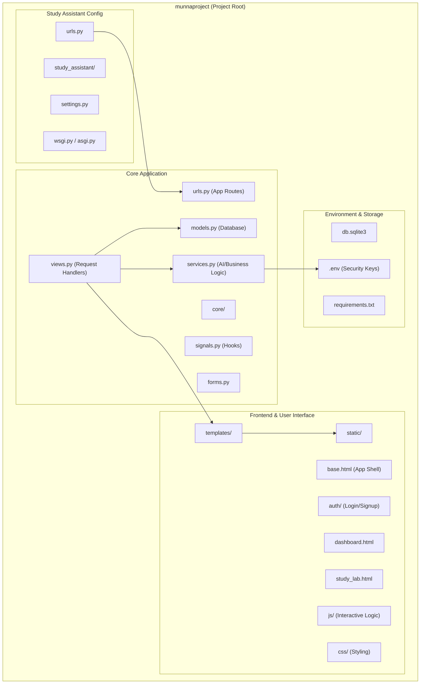

# Project Structure - Study Assistant

This document provides a visual and descriptive overview of the system architecture and file organization for the **Study Assistant** project.

## Architecture Diagram

The following diagram illustrates the core components of the Django application and how they interact.

---

## Directory Breakdown

### 📂 `core/`
The primary Django application containing the business logic.
- **`models.py`**: Defines the data structures for users, study materials, and logs.
- **`services.py`**: Contains specialized functions for AI integrations (like Groq/Gemini) and document processing.
- **`views.py`**: Orchestrates the flow between the models and the templates.

### 📂 `study_assistant/`
The project-level configuration folder.
- **`settings.py`**: Global settings, including database configuration, API endpoint registrations, and middleware.
- **`urls.py`**: The top-level URL dispatcher that routes requests to the `core` app.

### 📂 `templates/`
Contains HTML templates using Django's template engine.
- **`base.html`**: The parent template containing the main layout, sidebar, and design system.
- **`auth/`**: Templates for user registration and authentication.

### 📂 `static/`
Stores client-side assets.
- **`css/`**: Defined styles for the modern, premium aesthetic of the application.
- **`js/`**: Client-side logic for real-time dashboard updates and interactive features.

### 📂 `ganesh/` (Excluded from Diagram)
This is the Python Virtual Environment (venv). It contains all dependencies required to run the project.

---

> [!TIP]
> **Aesthetics Note**: The project follows a premium design philosophy with glassmorphism and modern HSL-based color palettes. Changes to global styling should be made in `static/css/` and `templates/base.html`.
